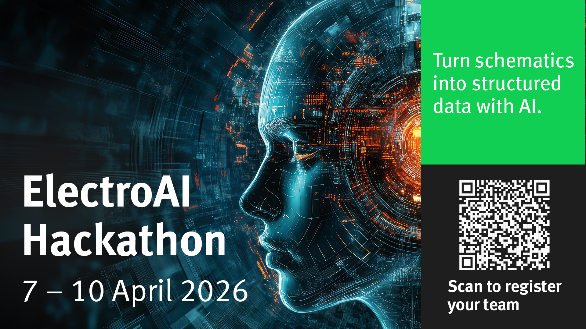

  

# ElectroAI Hackathon: Engineering Translation

**Bridging the Gap Between Visual Schematics and Digital Simulation**

The **ElectroAI Hackathon** (April 6 - 10, 2026) is a technically serious student event focused on using **AI Agents** to solve a persistent friction in engineering practice: the "translation bottleneck."

**[Register Now](https://forms.gle/Ajmfw7kZdqPx9pWHA)**

## The Problem Statement
Engineering design is visual before it is digital. Schematics are sketched on whiteboards, scanned from legacy documentation, or shared as screenshots. While readable by engineers, these artifacts are not directly usable by the tools that matter—simulators, layout editors, and design environments like KiCad, LTspice, or Proteus.

Gap analysis of the current engineering software landscape confirms that image interpretation, structured extraction, and cross-tool conversion remain weak. The ElectroAI Hackathon challenges you to bridge this gap by building AI-agent workflows that can reason over engineering content and produce actionable outputs.

## The Challenge
Teams are challenged to design AI-agent systems that accept engineering images or diagram-like inputs (photographs, PDFs, scans, whiteboard sketches), analyze them intelligently, and generate outputs ready for use in real engineering workflows.

This is more than OCR. It requires **Engineering Translation**:
- **Recognizing** component types and values from visual symbols.
- **Inferring** circuit topology and connectivity.
- **Reasoning** about design intent and functional blocks.
- **Generating** structured files (netlists, scaffolds, or tables) usable by professional EDA tools.

---

## Success Criteria

Longitudinal patient data presented in Excel reflects patient history contained in Word document.

## Judge Panel

- **[Dr Anita Wale](https://www.stgeorges.nhs.uk/people/dr-anita-wale/)**: Consultant Radiologist and Clinical Academic at St George’s University Hospitals NHS Foundation Trust.
- **[Dr Alex Nicholls](https://uk.linkedin.com/in/alex-nicholls-57301a38)**: Ministry of Defence.
- **[Hitesh Patel](https://uk.linkedin.com/in/hitesh-patel-68ab0223a)**: Superintendent Radiographer and Radiology IT Systems (RITS) Manager at St George’s University Hospitals NHS Foundation Trust.

## Event Schedule & Support

### Workshops (Tue April 7 – Thu April 9)
Join us for three days of focused technical sessions (1 hour per day per team):
- **Building AI Agents:** Learn how to design workflows specifically for schematic analysis.
- **Programmatic LLM Interaction:** Master expert prompting techniques to interact with models programmatically—**no previous software engineering skills required.**
- **Data & Documentation:** Techniques for effective data visualization and professional engineering documentation.

### The Allnighter (Thu April 9)
Gather at a venue near CSG for the official coding "allnighter." We’ll provide the fuel (**pizza + Monster**) while you start from scratch or fine-tune your project for the final presentation.

### Support & Baseline
- **Baseline Solution:** Every team will receive a functional baseline solution to jumpstart their project.
- **Expert Mentoring:** Access to mentors specialized in AI agentic tools and electrical engineering.
- **Community:** Join our official **Discord** for real-time support and updates: https://discord.gg/R3GpYZBXZ

### Final Presentation (Fri April 10)
Deliver your final project and presentation to our panel of judges.

---

## The Master Prompt
Use this "System Instruction" to ground your AI agent in the hackathon’s specific technical context:

> **Role:** You are an expert Electrical Engineering AI Agent specializing in schematic interpretation and structured data extraction. Your goal is to bridge the gap between visual engineering artifacts (PDFs, scans, photos, screenshots) and actionable engineering formats (KiCad, LTspice, Proteus, or structured JSON/XML).
>
> **The Problem:** Engineering diagrams are often locked in non-digital formats. Manual conversion to simulation-ready files is slow and error-prone. You must move beyond simple OCR to perform "Engineering Translation."
>
> **Your Task:**
> 1. **Analyze:** Deconstruct the visual input to identify component types, values, and visual topology.
> 2. **Reason:** Infer connectivity and circuit intent. Recognize standard ISO/IEEE symbols and identify functional blocks.
> 3. **Extract:** Generate a structured representation (e.g., a KiCad netlist, an LTspice scaffold, or a component-and-connectivity table).
> 4. **Validate:** Identify potential ambiguities or design rule violations in the source image.
>
> **Success Criteria:**
> - **Actionability:** Output must be usable by an engineer or a tool.
> - **Engineering Logic:** Prioritize topological correctness over aesthetic reproduction.
> - **Transparency:** Flag ambiguities rather than guessing incorrectly.

---

## Outputs & Judging
- **IEEE-Standard Paper:** Each team will produce a research paper written to professional IEEE publication standards.
- **Professional Judging:** Entries will be evaluated by expert Electrical Engineers based on technical rigor and engineering utility.
- **Transferable Skills:** Gain expertise in agentic workflows and prompt engineering—skills you can apply across all your academic modules and future career.
