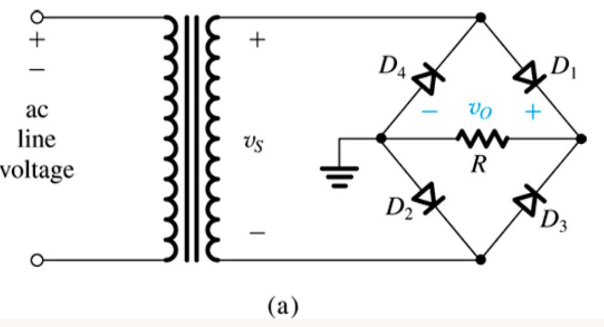

# Baseline Solution 3 — Agent Circuit Benchmark

## Overview

Each section below records one agent's analysis of a circuit schematic image.
For each circuit the agent produced:
- A Falstad interactive simulation link reconstructed from the image.
- An LTSpice-compatible `.cir` netlist saved under `baseline-solution/simulations/`.

Agents are identified by model name. Multiple agents may analyse the same circuit;
their entries appear as separate subsections under the same circuit heading.

---

## Circuit 1 — Full-Wave Bridge Rectifier

### Agent: claude-sonnet-4-6

**Circuit description:** A full-wave bridge rectifier using four diodes (D1–D4) arranged in a diamond bridge configuration. Both half-cycles of the 60 Hz AC input (transformer secondary Vs) are steered through the load resistor R, producing a full-wave rectified DC output voltage Vo. On positive half-cycles D1 and D3 conduct; on negative half-cycles D2 and D4 conduct, so the DC positive rail and ground polarity remain constant regardless of input polarity.

**Component count:** 6 components (4× diode, 1× resistor R, 1× AC source Vs)

**Falstad simulation:** [Open in Falstad](https://www.falstad.com/circuit/circuitjs.html#eNp1T7sOwkAM2-8rPLBycnLvz6nUwsKEgP4-SnV3XSAZYtl5OBcI6GmRIPRKaimBVXNrBYlIiAFpu4q4D2JFUFqRpiAEmZDcfAEtfXIrJBOaMrRWiCgU63Zb3o-XWxEl_9WMi-Q5_0Ob81N7nrt6DyEk3X0SR5VsBt0-zNuV4wm3Tzwu97b-agw6GIO2aVIdD1t0X6aeREU)

**LTSpice netlist:** [`simulations/01-claude-sonnet-4-6-bridge-rectifier.cir`](simulations/01-claude-sonnet-4-6-bridge-rectifier.cir)

> **Notes:** AC source modelled as a floating sinusoidal source (169.7 Vpeak, 60 Hz) with a 1 GΩ bias resistor to establish DC ground reference — negligible effect at 60 Hz. Diodes use the standard 1N4007 model. Transformer magnetising impedance not included.

---
