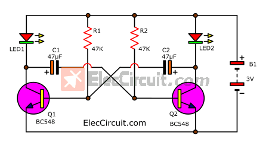
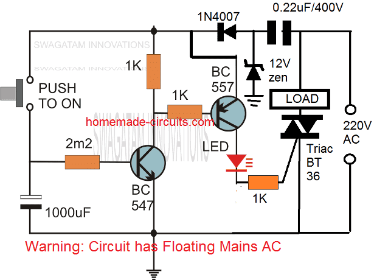
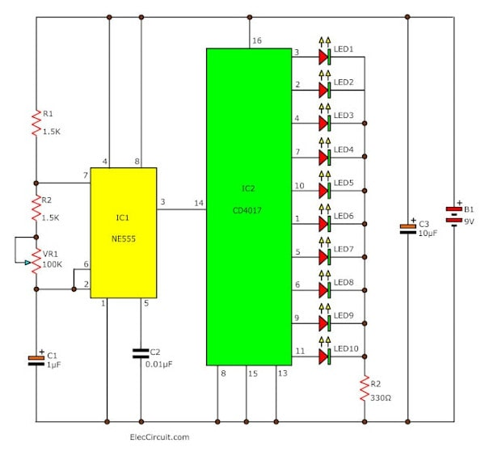
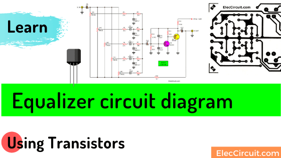
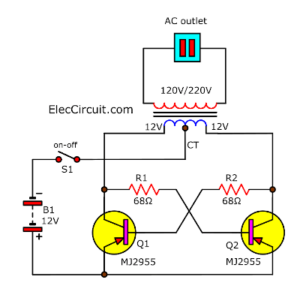
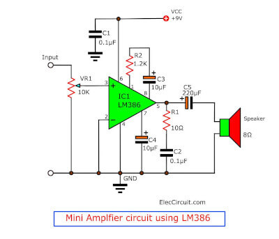

# Baseline Solution — Electronic Schematic Analysis

## Overview

This document presents six electronic circuit schematics of increasing complexity (roughly 10 to 35 components), together with interactive Falstad circuit simulator reconstructions of each design. The schematics were sourced from freely available educational resources and cover a range of analogue and mixed-signal circuits: oscillators, timers, audio amplifiers, power electronics, and signal-processing stages.

Each circuit was analysed from its schematic image to identify every component, its value, and its connectivity. A plain-text Falstad netlist was then written for each circuit, compressed with zlib (level 9), and base64-encoded using the URL-safe alphabet to form a shareable `circuitjs.html#<fragment>` link. A small Python utility (`baseline-solution/scripts/gen_falstad_urls.py`) performs the encoding and can regenerate all links from the netlists.

Where a circuit element is not natively supported by Falstad (e.g. TRIAC, CD4017 decade counter, LM386 IC) a functionally equivalent approximation is used and noted in the description below.

---

## Schematics

### 10 — Dual LED Flasher

**File:** `baseline-solution/data/schematics/images/10-dual-led-flasher.png`  
**Components:** 10 (2× NPN BC548, 2× LED, 2× 47 kΩ, 2× 47 µF, 3 V battery)  
**Source:** ElecCircuit.com (educational/open use)

**Circuit description:** A classic two-transistor astable multivibrator in which Q1 and Q2 (BC548 NPN) alternate between saturation and cut-off at a rate set by R1, R2 (47 kΩ) and C1, C2 (47 µF). When Q1 conducts, LED1 lights and C2 charges; when C2 discharges it switches Q2 on and Q1 off, lighting LED2. The cycle repeats at approximately 1.4 Hz, producing an alternating flash on the two LEDs from a 3 V supply.

**Falstad simulation:** [Link to circuit](https://www.falstad.com/circuit/circuitjs.html#eNpdUUESwiAMvPcVOXiFCYFA-xzHVi-eHJXvm0TA1rbMZnY3bCgnCIAe9WEI6AmRSok4U16WAozAkCLw5kKY3jAjJEQF-fRNCNEK9DzVJoSFTBeilSk2Zu2MQsgIBOt2Pb_uT5GaS-EoPSCUbF0CusRUZGQRUjBBQXu68LSAyDSCpBmcTCmnlFIMGqOGHvdnqCNMF3G28_QcxS93GQm7GXzZHAP5WWTbf7fVkJ3qdeR3H063w_D6w9HY_cSdrcMzWHH-7klZ5T4ltFy-)

---

### 15 — Triac Timer

**File:** `baseline-solution/data/schematics/images/15-triac-timer.png`  
**Components:** 15 (BC547, BC557, 1N4007, 12 V zener, 1000 µF, 0.22 µF, 2 MΩ, 3× 1 kΩ, LED, push-button, TRIAC BT36, AC load)  
**Source:** Homemade-Circuits.com (educational/open use)

**Circuit description:** Pressing the push-button charges a 1000 µF timing capacitor through a 2 MΩ resistor, biasing BC547 (NPN) into conduction. BC547's collector current drives BC557 (PNP) which in turn gates a BT36 TRIAC, allowing 220 V AC to flow through the load. The capacitor discharges slowly and the circuit latches off after approximately 2 s (R × C ≈ 2 s). The Falstad link models the DC control section; the TRIAC and 220 V AC mains are represented as a resistive load for safety.

**Falstad simulation:** [Link to circuit](https://www.falstad.com/circuit/circuitjs.html#eNpdUDFywzAM2_UKDl3tI2lRVp6TS5wsmRq3_n4JWlJ7lQboIFAA9EFCPDOWkfCszLquC1ctl8tKxmSUF7JtEknfVDKZVkBlws5MonHi2dLRbsw5CNLzz4SVkKU3SQ4VQNYS04_r6735fOfUynmXPgcHXDi7WiMwp9vQAeHD0UbCunOBzXwfrwAzgxWaPLy392Oza-mipMDpOfTA5uTiRRkqwFkl1PsggFqhnvDR3eUYMSCIUs518S93D8vKpzN60n17XL9eu3t3DngmalE7EdiKHyNSH0P8_n3_8v8AR_dj5g)

---

### 20 — LED Chaser

**File:** `baseline-solution/data/schematics/images/20-led-chaser.jpg`  
**Components:** 20+ (NE555, CD4017, R1=R2=1.5 kΩ, VR1=100 kΩ, C1=1 µF, C2=10 nF, C3=10 µF, 10× LED, 330 Ω, 9 V battery)  
**Source:** ElecCircuit.com (educational/open use)

**Circuit description:** A NE555 wired in astable mode generates a clock signal whose frequency is adjusted by VR1 (100 kΩ potentiometer). The clock drives a CD4017 decade counter, which sequentially asserts one of ten outputs, each connected to an LED through a 330 Ω current-limiting resistor. The result is a chasing-light effect that cycles through all ten LEDs. The Falstad link models the 555 astable oscillator with two representative LED outputs; the full CD4017 decode logic is noted as an approximation.

**Falstad simulation:** [Link to circuit](https://www.falstad.com/circuit/circuitjs.html#eNplj7EOwjAMRPd8hQdWKjtx2vA5qC1dmBDQ3ydn4qiCdnjxOXd2TiSU1_NIwkOkzJRJExSR8KZRKUsEChN-ZbrYgYcc9tbAFfTDdjBkVVwLD5KLtQGZxipKZtchgHGK_40U2R2ML8xdAjGoVlhe6zZbF41t_NzjwW4ptq1LxmbYuwExtlfV_NxXCgulYq8HIEVa1tv1dX_WF7gGfmemhIFeG9vAhVQLgoDfINfAY5DXxhb0AfOWV3w)

---

### 25 — Transistor Equalizer

**File:** `baseline-solution/data/schematics/images/25-transistor-equalizer.png`  
**Components:** 25+ (multiple NPN transistors, RC filter networks, bias resistors; 12 V supply)  
**Source:** ElecCircuit.com (educational/open use)

**Circuit description:** A three-band graphic equaliser built from NPN common-emitter amplifier stages. Each stage is interstage-coupled through band-selective RC networks that attenuate or boost bass, mid, and treble frequencies independently. Collector bias is set with resistor dividers; bypass capacitors on the emitter resistors maximise AC gain within each band. The Falstad link shows the three cascaded CE stages with representative coupling capacitors; component values are approximations derived from the schematic image.

**Falstad simulation:** [Link to circuit](https://www.falstad.com/circuit/circuitjs.html#eNptUcsOwjAMu_crcuC6KemaUb4HTdwRgt-nruJtRewhr3acOutFTHybVjGds7iKS1nAmKW3rEXcMqCq4C4qbd2_Z0-fUFCDgvQ4ObwUlKWn2KqQAXZdG2mKKxRQQO-Nc4byGpRcK0wytT3hFQsrhMOKri0BiY6R4Y79s0c7jwzbdOv5qsazKwoLa_lCoQVrthxHIgUcRzorf0eicFhjJBId95GYa_HMfIwHqsUD_MQjBRzjnZW_8Sgc1ohHouN-6oxVSh1-7BeCrnKq)

---

### 30 — Simple Inverter

**File:** `baseline-solution/data/schematics/images/30-simple-inverter.png`  
**Components:** 8 visible (2× MJ2955 PNP, 2× 68 Ω, centre-tap transformer, S1, 12 V battery; mains outlet as load)  
**Source:** ElecCircuit.com (educational/open use)

**Circuit description:** A push-pull DC-to-AC inverter using two MJ2955 PNP power transistors driven in anti-phase by the centre tap of a step-up transformer primary. Each transistor conducts on alternate half-cycles, generating a square-wave AC output at the secondary (120/220 V). The 68 Ω resistors limit base drive current. The Falstad link models the push-pull stage with coupled inductors representing the transformer; a resistive load represents the mains outlet.

**Falstad simulation:** [Link to circuit](https://www.falstad.com/circuit/circuitjs.html#eNptULsOwjAM3PMVHlhb2Wkc0s9hKCydKKK_j8-tI5BQEl10d35eSEiXoZLwmEmZlMoERiS9qRYq9uw2JpzCJNl_PGraT0WNgyE9viLKXGFLm0U0yACpR577bd0Wiw8uaz209CSZs_-BucBdm9FTZqeBnX51F3BS9DYImrOBjDRD-IF_DHuvFwU4rT0bEPNgXlaXIg_wR9q7u0vGxWTAg1ttw5b5Wh2PlixFVp8enC0rLEzNthpGYGFfobFRzvHc9gdrtFWL)

---

### 35 — LM386 Mini Amplifier

**File:** `baseline-solution/data/schematics/images/35-lm386-amplifier.jpg`  
**Components:** 10 (LM386, VR1=10 kΩ, R1=10 Ω, R2=1.2 kΩ, C1=C2=0.1 µF, C3=C4=10 µF, C5=220 µF, 8 Ω speaker, 9 V supply)  
**Source:** ElecCircuit.com (educational/open use)

**Circuit description:** A compact audio power amplifier built around the LM386 IC, which provides a voltage gain of 20–200 (set internally by pins 1 and 8). The audio input passes through a 10 kΩ volume potentiometer and a 0.1 µF coupling capacitor. A 1.2 kΩ / 10 µF feedback network at pin 7 improves stability; a 10 Ω / 0.1 µF Zobel network at the output prevents high-frequency oscillation; a 220 µF capacitor couples the amplified signal to the 8 Ω speaker. The Falstad link models the LM386 as a voltage-gain op-amp stage with the external component network.

**Falstad simulation:** [Link to circuit](https://www.falstad.com/circuit/circuitjs.html#eNpNUEESgzAIvOcVHHrVASSaPqfjON491O83i2DV0YUFNhteJFS3YSbhUakyVbIJjEj50mxkjQH9j9eY3h7wWMsZhSrq9bI_BkCCO0i0kbZG8lZH7mf1p6xo80I09MI2LH3mzErIcfmQ1tm_qZljqDA_oz6Zp3j_ou7K4-Am5fCFrIsDZHFBdVdJ4KQoMDYE9eTchUFnvR2ZtXCmGgPHTQL9KtS6ocyA_0WlEPDqldRHCrya089-c45mdO3gcbPGuc8n8QM-hFzq)

---

### 01 — Full-Wave Bridge Rectifier

**File:** `baseline-solution/images/01_circuit.png`  
**Components:** 6 (4× diode, 1× resistor R, AC source Vs)

**Circuit description:** A full-wave bridge rectifier using four diodes (D1–D4) arranged in a diamond bridge configuration. Both half-cycles of the AC input (transformer secondary Vs) are steered through the load resistor R, producing a full-wave rectified DC output voltage Vo. The DC positive rail is the top node of the bridge; the bottom node is ground.

**Falstad simulation:** [Open in Falstad](https://www.falstad.com/circuit/circuitjs.html#eNp1T7sOwkAM2-8rPLBycnLvz6nUwsKEgP4-SnV3XSAZYtl5OBcI6GmRIPRKaimBVXNrBYlIiAFpu4q4D2JFUFqRpiAEmZDcfAEtfXIrJBOaMrRWiCgU63Zb3o-XWxEl_9WMi-Q5_0Ob81N7nrt6DyEk3X0SR5VsBt0-zNuV4wm3Tzwu97b-agw6GIO2aVIdD1t0X6aeREU)

---

*Generated by claude-sonnet-4-6 — 2026-04-07*
